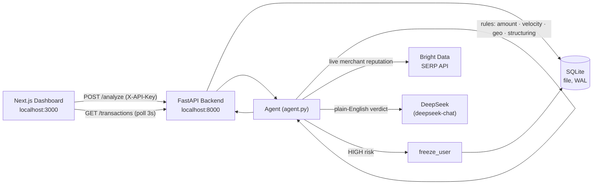

# Sentinel — Autonomous Real-Time Fraud Detection with Live Web Reputation

> An autonomous fraud-detection agent that scores every transaction, reads the same public web a human investigator would — via the **Bright Data SERP API** — explains its decision in plain English, and freezes accounts the instant risk goes HIGH.

**Tagline:** *Fraud detection that doesn't guess. It reads the web.*

Built for the **Web Data UNLOCKED Hackathon (Bright Data × lablab.ai)**. The full submission dossier is in [SUBMISSION.md](SUBMISSION.md).

## Why it's different

Traditional fraud engines reason in a vacuum — they see an `amount` and a user's history, but nothing about *who the merchant actually is*. A brand-new shell merchant looks identical to a legitimate one to a model that only sees numbers. The signal that exposes it — scam reports, Trustpilot ratings, BBB complaints, Reddit r/scams threads — lives on the **open web**. Sentinel uses the **Bright Data SERP API** to read that web on every transaction and wires the result into the decision.

## Architecture



On each transaction the agent: (1) runs a deterministic multi-signal risk floor, (2) calls Bright Data for the merchant's live web reputation (0–100), (3) feeds transaction + history + reputation to DeepSeek for a compliance-grade explanation, (4) combines all layers by **maximum risk** (no layer can be silently overridden downward), and (5) **autonomously freezes the account** on HIGH.

## Tech Stack

- **Backend:** FastAPI · Pydantic v2 · SQLite (file-based, WAL) · `httpx` (Bright Data calls) · OpenAI Python SDK (DeepSeek client) · SlowAPI (rate limiting)
- **Web data:** **Bright Data SERP API** — live merchant reputation
- **LLM:** DeepSeek `deepseek-chat` (OpenAI-compatible API) — with a deterministic heuristic fallback if no key is set
- **Frontend:** Next.js 16 (App Router) · React 19 · TypeScript · Tailwind v4 · Axios · React Context (3s polling, fade-in on new rows)
- **Orchestration:** Docker Compose

## Bright Data integration

For each merchant, Sentinel issues a Google search through Bright Data and scores the result:

```
query = "{merchant} reviews scam complaints"
POST https://api.brightdata.com/request
{ "zone": "serp_api1", "url": "https://www.google.com/search?q=<query>&brd_json=1", "format": "raw" }
Authorization: Bearer $BRIGHTDATA_API_KEY
```

`brd_json=1` returns the SERP as structured JSON. The top 5 organic results are scored deterministically ([backend/brightdata_scoring.py](backend/brightdata_scoring.py)): scam-flag domains −30 each, Trustpilot ≥4.5★ +20, BBB +15, Reddit r/scams −20, reputable news +10. Base 50, clamped to [0, 100].

- **Wired into the decision:** a merchant scoring `< 30` raises risk to ≥ MEDIUM; `< 15` forces HIGH — a reputation floor the rest of the engine cannot weaken.
- **Cached:** every lookup is persisted with a 24h TTL. First sighting of a merchant = live web call (~1–3s); every subsequent one = sub-millisecond cache hit.
- **Disabled-safe:** if `BRIGHTDATA_API_KEY` is empty, lookups return `mode="disabled"` and the system degrades gracefully to numeric heuristics — so it runs with or without a key.

## Setup

```bash
git clone <your-repo-url> sentinel
cd sentinel
cp .env.example .env
# Set DEEPSEEK_API_KEY and BRIGHTDATA_API_KEY (leave either blank to use its fallback).
# SENTINEL_API_KEY is the dashboard<->backend auth key; the compose file feeds the
# same value into the frontend build so they always match.
docker compose up --build
```

- Dashboard → http://localhost:3000
- API       → http://localhost:8000

> **Bright Data $250 credit:** brightdata.com → Billing → Overview → apply promo code `unlocked`.

### Local dev (no Docker)

```bash
# Terminal 1 — backend
cd backend && source venv/bin/activate
pip install -r requirements.txt   # first time only
uvicorn main:app --reload

# Terminal 2 — frontend
cd frontend && npm run dev
```

### Run the tests

```bash
cd backend && ./venv/bin/python -m pytest    # test_agent / test_brightdata / test_brightdata_scoring
```

## API

All data endpoints require an `X-API-Key` header matching `SENTINEL_API_KEY`. The health check (`GET /`) is open.

| Method | Path | Purpose |
|---|---|---|
| `GET` | `/` | Health check (no auth) |
| `GET` | `/transactions` | All transactions, newest first (incl. web-rep fields) |
| `GET` | `/transactions/{id}/web-rep` | Full cached SERP evidence for a transaction's merchant |
| `POST` | `/analyze` | Analyze + persist + autonomously freeze on HIGH (rate-limited 60/min) |
| `POST` | `/unfreeze/{user_id}` | Human override to restore a frozen account |

### POST /analyze

```bash
curl -X POST http://localhost:8000/analyze \
  -H "Content-Type: application/json" \
  -H "X-API-Key: sentinel-dev-key" \
  -d '{
    "id": "tx-001", "user_id": "u1", "amount": 9000,
    "location": "Lagos, Nigeria", "timestamp": "2026-05-19T03:14:00",
    "merchant": "Unknown Wire Transfer"
  }'
```

Response (immediate deterministic verdict; a background Bright Data + DeepSeek pass can later raise the risk and fill in `web_rep_*`):

```json
{
  "transaction": { "id": "tx-001", "user_id": "u1", "amount": 9000, "...": "..." },
  "risk_level": "HIGH",
  "fraud_score": 1.0,
  "explanation": "Transaction of $9000.00 at Unknown Wire Transfer ...",
  "action_taken": "account_frozen",
  "account_frozen": true,
  "web_rep_score": null,
  "web_rep_signals": []
}
```

Once frozen, any further `/analyze` for that user returns `423 Locked` until `POST /unfreeze/{user_id}`.

## Demo

The fastest demo is the dashboard itself: open http://localhost:3000 and click **Simulate Suspicious Transaction**. Each click sends a fresh high-value transaction to a sanctioned-country merchant, which is flagged **HIGH**, the account is **frozen autonomously**, and the **Web Rep** badge resolves from a live Bright Data lookup — click it to see the actual SERP evidence.

To drive bulk traffic from the shell:

```bash
./scripts/simulate_attack.sh   # sends X-API-Key automatically
```

## Notes

- **Dual-mode agent:** with a real `DEEPSEEK_API_KEY` it uses `deepseek-chat` for the explanation and risk; with no key it falls back to a fully deterministic heuristic (`amount ≥ 5000` OR `≥ 30× user's recent avg` → HIGH), so the demo always works and is reproducible. On any LLM API error it falls back to the heuristic with the error annotated.
- **Security:** `X-API-Key` auth on all data endpoints; CORS locked to the `CORS_ORIGINS` allow-list (default `http://localhost:3000`); 60/min rate limit on `/analyze`; strict Pydantic input validation (422 on bad input, 409 on duplicate id, 423 on frozen account).
- **Persistence:** SQLite is **file-based** (`sentinel.db`, WAL mode) — data persists across restarts. Delete `backend/sentinel.db*` to reset.

## Screenshots

_Capture the dashboard mid-demo (one green LOW row + one HIGH/frozen row, ideally with the Web Rep evidence modal open) and save it to `docs/screenshot.png` — it doubles as the lablab cover image._
